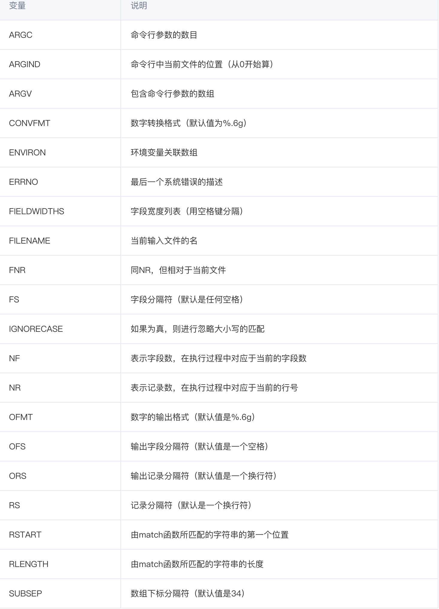

# Linux Learning

## awk Tutorials

### 格式化输出方式：
1.  输出函数：awk的输出主要靠 print,printf，这两个指令的用法和c语言中的 print，printf 一毛一样。awk处理每行时是以列为每个域，例如 print $1 就是输出第一列，print $1,$2 就是输出第1、2列，print $0 输出全部。
2. 怎么区分列：awk怎么区分列呢，默认是以空格区分，但是你也可以通过 -F 参数指定，例如 -F; 指定分号为分隔符，-F[;,] 指定分号和逗号为分隔符。

#### 实战：
1. 只想打印第一列和第四列的内容
```
   cat utils/top.txt | awk '{print $1, $2}' 
```

2. 对齐不整齐，打印的更漂亮些？能加上行号
```
    cat utils/top.txt | awk '{printf "%-8s %-8s %-8s %-18s\n",NR, $1, $2, $8}'
    // 其中，%-8s 用过c语言输出的一定很眼熟，另外看到一个新的东西 NR，更多命令参考如下表格
```


3. 去掉第一行，只输出cpu消耗大于0的
```
    cat utils/top.txt | awk 'NR>1 && $9>0 {printf "%-8s %-8s %-18s\n",$1,$9,$12}'
```

[参考]:https://cloud.tencent.com/developer/article/1159061#:~:text=awk%E6%98%AF%E4%B8%80%E7%A7%8D%E7%BC%96%E7%A8%8B,%E6%98%AF%E4%BD%9C%E4%B8%BA%E8%84%9A%E6%9C%AC%E6%9D%A5%E4%BD%BF%E7%94%A8%E3%80%82
