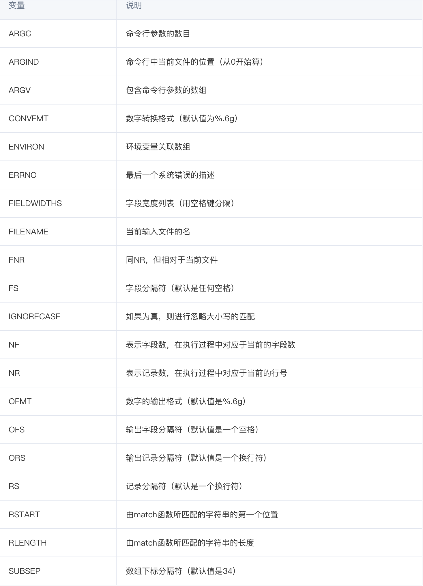

# Linux Learning

## awk Tutorials
### 命令格式
```shell
# 格式
$ awk 动作 文件名

# 示例
$ awk '{print $0}' demo.txt

# demo.txt是awk所要处理的文本文件。前面单引号内部有一个大括号，里面就是每一行的处理动作print $0。其中，print是打印命令，$0代表当前行，因此上面命令的执行结果，就是把每一行原样打印出来。
```

### 分割符
```shell
awk -F ':' '{ print $1 }' demo.txt
# 这个文件的字段分隔符是冒号（:），所以要用-F参数指定分隔符为冒号。然后，才能提取到它的第一个字段。
```

### 变量
```shell
echo 'this is a test' | awk '{print $NF}'
# 变量NF表示当前行有多少个字段，因此$NF就代表最后一个字段。$(NF-1)代表倒数第二个字段

awk -F ':' '{print NR ") " $1}' demo.txt
# 变量NR表示当前处理的是第几行。
```

### if 语句
```shell
$ awk -F ':' '{if ($1 > "m") print $1}' demo.txt
#awk提供了if结构，用于编写复杂的条件。
```
### 格式化输出方式：
>1. 输出函数：awk的输出主要靠 print,printf，这两个指令的用法和c语言中的 print，printf 一毛一样。awk处理每行时是以列为每个域，例如 print $1 就是输出第一列，print $1,$2 就是输出第1、2列，print $0 输出全部。
>2. 怎么区分列：awk怎么区分列呢，默认是以空格区分，但是你也可以通过 -F 参数指定，例如 -F; 指定分号为分隔符，-F[;,] 指定分号和逗号为分隔符。


### 实战：
1. 只想打印第一列和第四列的内容
```
   cat utils/top.txt | awk '{print $1, $2}' 
```

2. 对齐不整齐，打印的更漂亮些？能加上行号
```
    cat utils/top.txt | awk '{printf "%-8s %-8s %-8s %-18s\n",NR, $1, $2, $8}'
    // 其中，%-8s 用过c语言输出的一定很眼熟，另外看到一个新的东西 NR，更多命令参考如下表格
```


3. 去掉第一行，只输出cpu消耗大于0的
```
    cat utils/top.txt | awk 'NR>1 && $9>0 {printf "%-8s %-8s %-18s\n",$1,$9,$12}'
```
4. 仅输出ip
```shell
    cat ./utils/ip.txt| awk '{print $1}'
```
5. 按字符串规则排序：
```shell
    cat ./utils/ip.txt| awk '{print $1}' | sort
```
6. 去重计数:
```shell
    cat ./utils/ip.txt| awk -F ' '  '{print $1}' | sort | uniq -c
    # 去重（uniq）前要排序（sort）
```
7. 按首列数字倒叙排列输出：
```shell
   cat ./utils/ip.txt| awk -F ' ' '{print $1}' | sort | uniq -c | sort -nr
   # sort -n表示计数从小到大输出 sort -r表示倒序输出
```
8. 取对应行数：
```shell
   cat ./utils/ip.txt| awk -F ' ' '{print $1}' | sort | uniq -c | sort -nr | head -n 2
```
9. 另一种方式：
```shell
    cat ./utils/ip.txt | awk '{a[$1]++}END{for(i in a) print a[i],i}'|sort -nr|head -n 2
```


### 参考
1. [awk 使用教程 - 通读篇（30分钟入门）](https://cloud.tencent.com/developer/article/1159061#:~:text=awk%E6%98%AF%E4%B8%80%E7%A7%8D%E7%BC%96%E7%A8%8B,%E6%98%AF%E4%BD%9C%E4%B8%BA%E8%84%9A%E6%9C%AC%E6%9D%A5%E4%BD%BF%E7%94%A8%E3%80%82)
2. [30 Examples for Awk Command in Text Processing](https://likegeeks.com/awk-command/)
3. [日志处理cat、awk、sort、uniq、head多命令使用](https://www.jianshu.com/p/e3a375609e83)
